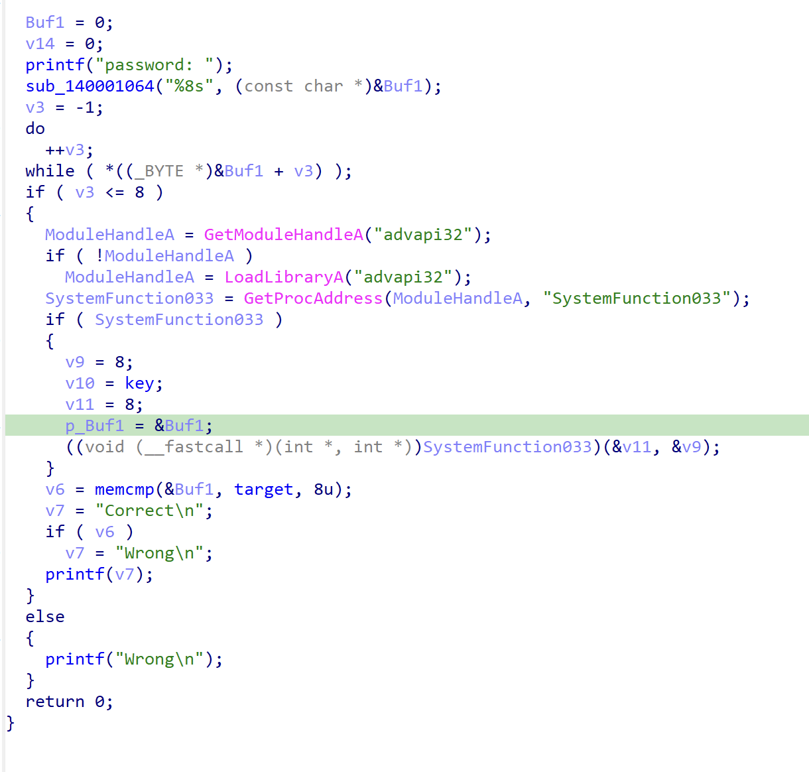
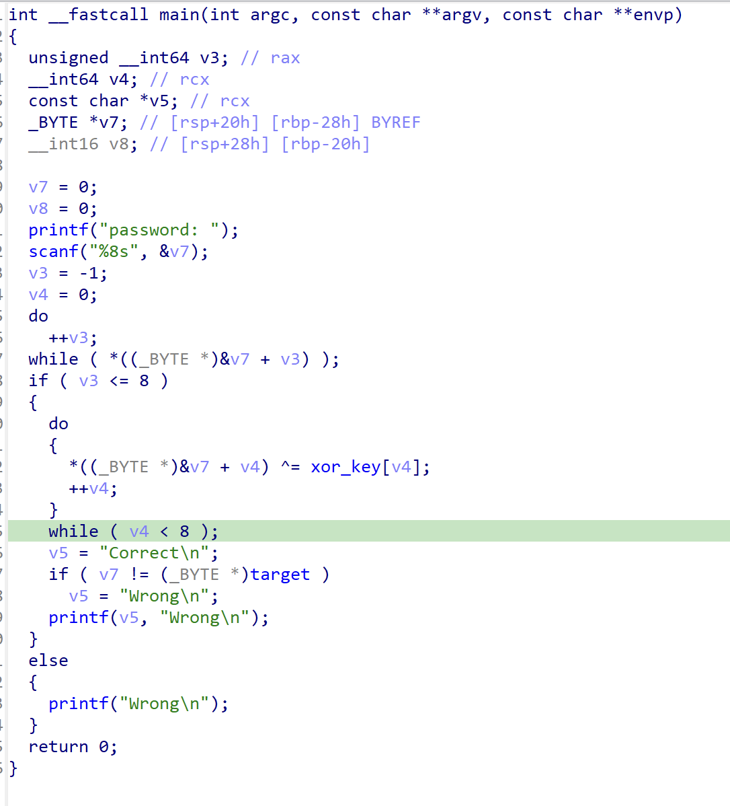
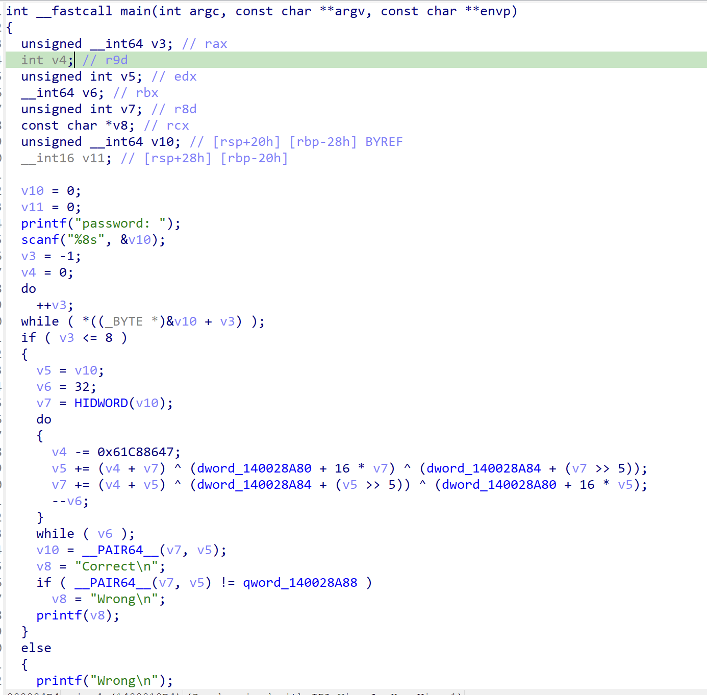
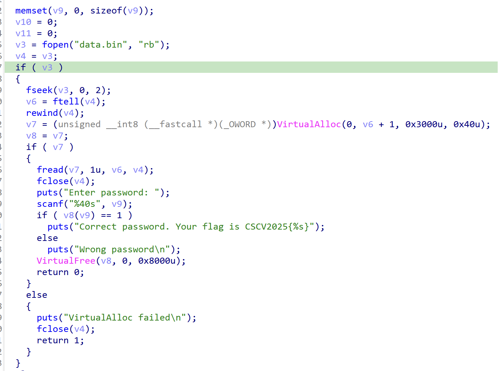
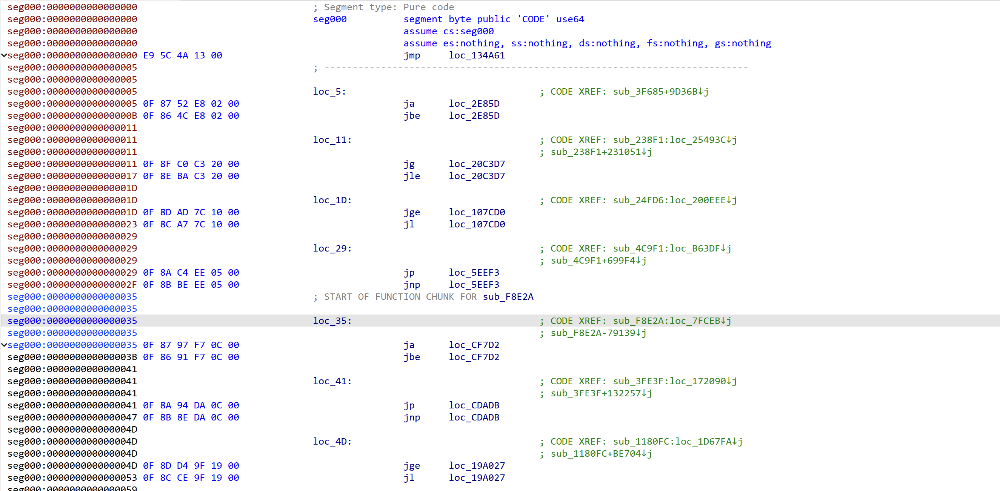
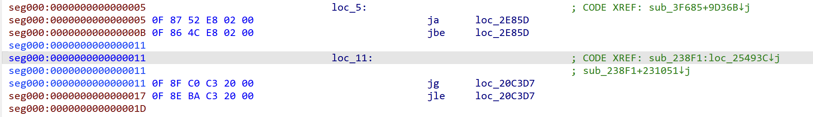
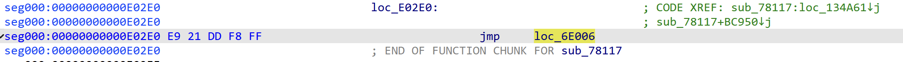
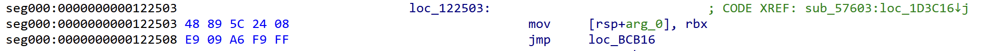

This year, I qualified for the Group A Final of the Cybersecurity Student Contest Vietnam(CSCV) 2025 as team HCMUT.i_dont_think_we_have_a_name. Here is my write-up for 2/3 jeopardy reverse engineering challenge in the final of **CSCV 2025 Group A Final**.

## Re01
> Given files: [Get it here](https://drive.google.com/file/d/15x5h2m1Oomno5FYk-uFxwS4s3VnmQGMa/view?usp=sharing)

### Overview
The challenges provides us with the 42 binaries, each works as a checker for the input.

### Analysis
Analyzing the given executable files, there are three types of checker:
- The first one is RC4 encryption (The function `SystemFunction033` in Windows is RC4 encryption):


- The second is simply a xor operation:


- The third type is a TEA-like encryption:


Analyzing the instructions's mnemonic, I found the pattern in each file and use that to differentiate the encryption type and dump constants in each files which the `encryption key` and `target`. Here is the code for that:
```py
import lief
import capstone
from Crypto.Cipher import ARC4
import struct
from tqdm import tqdm

rc4_signature = ['call', 'lea', 'mov', 'call', 'test', 'je', 'lea']

xor_signature = ['lea', 'mov', 'xor', 'inc', 'cmp']

tea_signature = ['mov', 'mov', 'mov', 'lea', 'shr']

ROUNDS = 32
DELTA = 0x9E3779B9

def u32(x): return x & 0xFFFFFFFF


class Solver:
    def __init__(self, params):
        self.type = params['type']
        self.key = params['key']
        self.target = params['target']

    def rc4_decrypt(self):
        cipher = ARC4.new(key=bytes(self.key))
        return list(cipher.decrypt(bytes(self.target)))

    def xor_decrypt(self):
        return [a ^ b for a, b in zip(self.key, self.target)]
    
    def tea_decrypt(self, rounds=32):
        c_lo = int.from_bytes(self.target[:4], 'little')
        c_hi = int.from_bytes(self.target[4:8], 'little')
        k0 = int.from_bytes(self.key[:4], 'little')
        k1 = int.from_bytes(self.key[4:8], 'little')
        v8 = u32(c_lo)
        v4 = u32(c_hi)
        s = u32(DELTA * rounds)
        for _ in range(rounds):
            v4 = u32(v4 - (u32(s + v8) ^ u32(k1 + (v8 >> 5)) ^ u32(k0 + ((v8 << 4) & 0xFFFFFFFF))))
            v8 = u32(v8 - (u32(s + v4) ^ u32(k0 + ((v4 << 4) & 0xFFFFFFFF)) ^ u32(k1 + (v4 >> 5))))
            s = u32(s - DELTA)

        pwd = list(struct.pack("<II", v8, v4))
        return pwd
    
    def solve(self):
        if self.type == 'rc4':
            return self.rc4_decrypt()
        elif self.type == 'xor':
            return self.xor_decrypt()
        elif self.type == 'tea':
            return self.tea_decrypt()

def extract_data(elf, address, nbytes) -> bytes:
    return bytes(elf.get_content_from_virtual_address(address, nbytes))

def match_signature(instructions, start_idx, signature) -> bool:
    if start_idx + len(signature) > len(instructions):
        return False
    for i, mnem in enumerate(signature):
        if instructions[start_idx + i].mnemonic != mnem:
            return False
    return True

def extract_data(elf, address, nbytes) -> bytes:
    return bytes(elf.get_content_from_virtual_address(address, nbytes))

def rip_mem_target(ins):
    if not hasattr(ins, "operands"):
        return None
    for op in ins.operands:
        if op.type == capstone.x86.X86_OP_MEM and op.mem.base == capstone.x86.X86_REG_RIP:
            return ins.address + ins.size + op.mem.disp
    return None

def detect_and_extract(pe, instructions):
    params = {}
    key = []
    target = []
    i = 0
    while i < len(instructions):
        if match_signature(instructions, i, rc4_signature):
            mem_addr = rip_mem_target(instructions[i + len(rc4_signature) - 1])
            data = extract_data(pe, mem_addr, 16)
            key, target = data[0:8], data[8:16]
            params['type'] = 'rc4'
            params['key'] = key
            params['target'] = target
            return params
        elif match_signature(instructions, i, xor_signature):
            mem_addr = rip_mem_target(instructions[i])
            data = extract_data(pe, mem_addr, 16)
            key, target = data[:8], data[8:16]
            params['type'] = 'xor'
            params['key'] = key
            params['target'] = target
            return params
        elif match_signature(instructions, i, tea_signature):
            mem_addr = rip_mem_target(instructions[i + 1])
            data = extract_data(pe, mem_addr, 16)
            key, target = data[0:8], data[8:16]
            params['type'] = 'tea'
            params['key'] = key
            params['target'] = target
            return params
        i += 1

def process_single_file(bin_path):
    pe = lief.parse(bin_path)
    if not pe: raise RuntimeError(f"Bad PE: {bin_path}")

    cs = capstone.Cs(capstone.CS_ARCH_X86, capstone.CS_MODE_64)
    cs.detail = True

    start_addr = 0x1400010B4

    code = extract_data(pe, start_addr, 200000) 
    instructions = list(cs.disasm(code, start_addr))

    params = detect_and_extract(pe, instructions)
    solver = Solver(params)
    return solver.solve()

pwd = ''

for i in tqdm(range(0, 43)):
    file = f'{i}.exe'
    pwd += bytes(process_single_file(file)).decode()
print(pwd)
```

Run this script and you'll get a very long base64 strings `Vm0weE5GbFdWWGhUV0doV1YwZG9WVmxVU2xOWFZteDBaRWRHVjFac2JETlhhMXBQVmxVeFdHVkdiR0ZXVm5BelZrZHplRll4WkhOaFJtUk9ZbTFvYjFaclpIcGxSMDUwVTJ0V1ZXSkdXbGhaYTFwM1ZGWmFkR05GWkZSTlYxSkpWbTEwYTFVeVNraFZiRkpWVmtWd1QxcFZXbXRXVmtaMFpFWldhVlpzY0VoV1JFWmhWakZXZEZOc2FHaFNiRXBZV1d4b2IwMHhjRVpYYlVaWFZteEtNVmRyV2xkVWJGbDRVMWhrVjJGcmJ6QlZla1pYVmpGa2NsWnNTbGRTTTAwMQ==`. I used this code to decode it until I got the flag prefixes which are `CSCV`:
```py

import base64

pwd = 'Vm0weE5GbFdWWGhUV0doV1YwZG9WVmxVU2xOWFZteDBaRWRHVjFac2JETlhhMXBQVmxVeFdHVkdiR0ZXVm5BelZrZHplRll4WkhOaFJtUk9ZbTFvYjFaclpIcGxSMDUwVTJ0V1ZXSkdXbGhaYTFwM1ZGWmFkR05GWkZSTlYxSkpWbTEwYTFVeVNraFZiRkpWVmtWd1QxcFZXbXRXVmtaMFpFWldhVlpzY0VoV1JFWmhWakZXZEZOc2FHaFNiRXBZV1d4b2IwMHhjRVpYYlVaWFZteEtNVmRyV2xkVWJGbDRVMWhrVjJGcmJ6QlZla1pYVmpGa2NsWnNTbGRTTTAwMQ=='
while not pwd.startswith('CSCV'):
    try:
        pwd = base64.b64decode(pwd).decode('utf-8')
        # print(f"\nDecoded message: {pwd}")
    except Exception as e:
        print(f"\nError decoding: {e}")

print(pwd)
```

And then get the flag.

Flag: `CSCV2025{AU7oMATION_is_thE_K3Y}`

## Re02
> Given files: [Get it here](https://drive.google.com/file/d/1QumW7rHOQ-uQeLGMUDEAH5BOS2Mn69mS/view?usp=sharing)

### Overview
In this challenge, we received two files which are `Loader.exe` and `data.bin`. We can easily see that the `Loader.exe` works as a loader for the flag checker logic inside the `data.bin`.


### Analysis
Dive into the logic of the `data.bin`, the program flow is heavily obfuscated using using multiple branching instructions.


Observe the jumping pattern closely, there are two types of jump instruction. The first one is the pair of branching instructions, but all of them branch into the same target address, which makes them have no difference from a single `jump` instructions:


The second one is the direct `jmp` instructions: 


Keep following the flow, finally we can reach a non-jump instrucions:


Here I started to realize the real logic behind the obfuscation, the programs utilizes a lot of jumps functions and during that, the real logic instructions is hidden in the flow. From that, I started planning an deobfuscation approach for the problem.

Firstly, I write a code to emulate the behavior of the program. To extract the real logic from the obfuscated code, I blacklisted all the branching instructions, to filter out the obfuscated parts, also I add a check for 2 adjacent branching instrustrion with difference target (which usually happens after a `cmp` or `test` instructions). Also, after analyzing the the branching control flow further, I see that the target branch is the seconde branch, making that assumption, I wrote a deobfscation script to extract the real logic of the program:
```py
import capstone
import lief

cs = capstone.Cs(capstone.CS_ARCH_X86, capstone.CS_MODE_64)
cs.detail = True

code = open('../src/data.bin', 'rb').read()

pe: lief.PE.Binary = lief.PE.parse('Loader.exe')

function_calls = []

blacklist = ['jmp', 'ja', 'jbe', 'jl', 'jp', 'jnp', 'jo', 'jge', 'jl', 'je', 'jae', 'js', 'jns', 'jno', 'jg', 'jle', 'jb', 'jne']

def sign_extend_8(value):
    if value & 0x80:
        return value - 0x100
    return value

def sign_extend_32(value):
    if value & 0x80000000:
        return value - 0x100000000
    return value

def extract_offset(ins):
    if len(ins.bytes) == 2:
        offset = sign_extend_8(int(ins.bytes[-1:].hex(), 16))
    else:
        offset = sign_extend_32(int.from_bytes(ins.bytes[-4:], 'little'))
    return offset


choose = lambda a, b: a if a not in FAIL else b

print("-----Main-----")
def deobs(code, start_addr):
    global FAIL, function_calls, lift_code
    end = False
    rip = start_addr
    while True:

        cnt = 0
        if cnt == 1000:
            break
        instructions = list(cs.disasm(code[rip:rip+20], 0))
        for idx, ins in enumerate(instructions):
            if ins.mnemonic in blacklist:
                offset = extract_offset(ins)
                if ins.mnemonic != 'jmp':
                    offset2 = extract_offset(instructions[idx + 1])
                    offset = extract_offset(ins)
                    if offset2 + ins.size != offset:
                        branch1 = rip + ins.size + offset
                        branch2 = rip + ins.size + instructions[idx + 1].size + offset2
                        print(f'[{hex(rip)}]', ins.mnemonic, hex(branch1))
                        print(f'[{hex(rip + ins.size)}]', instructions[idx + 1].mnemonic, hex(branch2))
                        rip = branch2
                        break
                rip += ins.size + offset
                break
            elif ins.mnemonic == 'call':
                offset = sign_extend_32(int.from_bytes(ins.bytes[-4:], 'little'))
                call_addr = rip + ins.size + offset
                print(f'[{hex(rip)}]', ins.mnemonic, hex(call_addr))
                rip += ins.size
                if call_addr not in function_calls:
                    function_calls.append(call_addr)
            else:
                print(f'[{hex(rip)}]', str(ins).split(': ')[1].strip('>'))
                rip += ins.size
                if ins.mnemonic == 'ret':
                    end = True
                    break
        if end:
            break
        cnt += 1

deobs(code, 0)
print('=' * 36)

for func in function_calls:
    print(f'----sub_{hex(func)[2:]}----')
    deobs(code, func)
    print('=' * 36)
```
For the output of the deobfuscation process, you can find the file [here](https://drive.google.com/file/d/1KRTs-H9FQeFBGrOD3POSdCTo8XdxEhU9/view?usp=sharing). Now, we have the real logic of the program, we can the extracted dissassembler code:
```
[0x122503] mov qword ptr [rsp + 8], rbx
[0x11e043] mov qword ptr [rsp + 0x10], rsi
[0x1109d1] push rdi
[0x210e37] sub rsp, 0x20
[0xcea75] xor edx, edx
[0x125ef] mov r9, rcx
[0x1231a9] mov rax, rcx
[0x19f5ad] cmp byte ptr [rcx], dl
[0x135658] je 0x7315
[0x13565e] jmp 0x193ac5
[0x255736] nop 
[0xcf0ea] inc rdx
[0x5b50d] lea rax, [rax + 1]
[0x621c5] cmp byte ptr [rax], 0
[0x2276f7] jne 0xcf0ea
[0x2276fd] jmp 0x226149
[0x71e98] cmp rdx, 0x20
[0x224195] jne 0x7315
[0x22419b] jmp 0x78d2e
[0x63bab] mov rcx, qword ptr [rcx + 8]
[0x1af344] call 0x1569eb
[0x21990b] mov rcx, qword ptr [r9 + 0x10]
[0x220b78] mov rsi, rax
[0x4cb76] call 0x1569eb
[0x15688c] mov rcx, qword ptr [r9 + 0x18]
[0x142ecb] mov rdi, rax
[0x18d479] call 0x1569eb
[0x21d66d] mov rcx, qword ptr [r9]
[0x94101] mov rbx, rax
[0x2253ac] call 0x1569eb
[0x1ee5e0] mov rcx, rax
```
Note that the pointer to our input buffer is in `rcx` (based on Windows calling convention, or you can read the function calls in the `Loader.exe`). We can interpret the code above as follow: 
- It checks the input length to be 32-byte long, and then split the input into 4 chunk and transform them using the function in the virtual address `0x1569eb`:

```
----sub_1569eb----
[0x1569eb] mov edx, ecx
[0x57e33] mov rax, rcx
[0x5d011] shr rax, 0x20
[0x15eb0c] ror edx, 0x19
[0x68e97] xor edx, eax
[0x1b2d72] xor edx, 0x9b32e18b
[0x245a86] mov eax, edx
....
[0x24a12e] xor eax, 0x5d1e6a11
[0xc287b] mov edx, eax
[0xd46b1] ror eax, 0x19
[0x6bee8] xor rax, rcx
[0x122f6e] shl rdx, 0x20
[0x182c95] mov ecx, 0x8c37b93a
[0x16c305] xor rax, rcx
[0x131085] or rax, rdx
[0xf4afa] ret 
```
Rewrite the transformation into Python, we have:
```py
def ror(val, r_bits, max_bits=32):
    return ((val >> r_bits) | (val << (max_bits - r_bits))) & ((1 << max_bits) - 1)

def sub_1569eb(v):
    CONSTANTS = [
        0x9b32e18b, 0x482f7c0b, 0x5d1e6a0d, 0x8c37b926,
        0x9b32e18f, 0x482f7c0f, 0x5d1e6a09, 0x8c37b922,
        0x9b32e183, 0x482f7c03, 0x5d1e6a05, 0x8c37b92e,
        0x9b32e187, 0x482f7c07, 0x5d1e6a01, 0x8c37b92a,
        0x9b32e19b, 0x482f7c1b, 0x5d1e6a1d, 0x8c37b936,
        0x9b32e19f, 0x482f7c1f, 0x5d1e6a19, 0x8c37b932,
        0x9b32e193, 0x482f7c13, 0x5d1e6a15, 0x8c37b93e,
        0x9b32e197, 0x482f7c17, 0x5d1e6a11, 0x8c37b93a
    ]

    l = v & 0xFFFFFFFF
    h = (v >> 32) & 0xFFFFFFFF
    
    prev_prev = h
    prev = l
    
    for k in CONSTANTS:
        curr = ror(prev, 25) ^ prev_prev ^ k
        prev_prev = prev
        prev = curr
        
    return (prev_prev << 32) | prev
```

We can reverse the transformation above with this code:
```py
def ror(val, r_bits, max_bits=32):
    return ((val >> r_bits) | (val << (max_bits - r_bits))) & ((1 << max_bits) - 1)

def inv_transform(target):
    CONSTANTS = [
        0x9b32e18b, 0x482f7c0b, 0x5d1e6a0d, 0x8c37b926,
        0x9b32e18f, 0x482f7c0f, 0x5d1e6a09, 0x8c37b922,
        0x9b32e183, 0x482f7c03, 0x5d1e6a05, 0x8c37b92e,
        0x9b32e187, 0x482f7c07, 0x5d1e6a01, 0x8c37b92a,
        0x9b32e19b, 0x482f7c1b, 0x5d1e6a1d, 0x8c37b936,
        0x9b32e19f, 0x482f7c1f, 0x5d1e6a19, 0x8c37b932,
        0x9b32e193, 0x482f7c13, 0x5d1e6a15, 0x8c37b93e,
        0x9b32e197, 0x482f7c17, 0x5d1e6a11, 0x8c37b93a
    ]
    prev_prev = (target >> 32) & 0xFFFFFFFF
    prev = target & 0xFFFFFFFF
    
    for k in reversed(CONSTANTS):
        old_prev = prev_prev
        old_prev_prev = prev ^ ror(old_prev, 25) ^ k

        prev = old_prev
        prev_prev = old_prev_prev

    return (prev_prev << 32) | prev
```

After 4 chunks have been transformed, then it perform validation step, here you can see the pattern that the program shifts bits of each chunk to check with the hardcoded bit value by chaining a lot of function calls.

```
----sub_33f17----
[0x33f17] mov qword ptr [rsp + 8], rcx
[0x15aca3] sub rsp, 0x28
[0x50559] mov rcx, qword ptr [rsp + 0x30]
[0x1ee172] call 0x74b22
[0x16ddd5] add rsp, 0x28
[0x117f37] ret 

----sub_74b22----
[0x74b22] mov qword ptr [rsp + 8], rcx
[0x239195] sub rsp, 0x28
[0x16e334] mov rax, qword ptr [rsp + 0x30]
[0x24bc95] and rax, 1
[0x10743f] cmp rax, 1
[0x17ed98] jne 0xddd36
[0x17ed9e] jmp 0x117223
[0x1fbdbe] mov rax, qword ptr [rsp + 0x30]
[0x318be] shr rax, 1
[0x11caa1] mov rcx, rax
[0x53571] call 0x119da3
[0x1b99cf] add rsp, 0x28
[0x1b70d] ret 

----sub_119da3----
[0x119da3] mov qword ptr [rsp + 8], rcx
[0x100965] sub rsp, 0x28
[0x1f1691] mov rax, qword ptr [rsp + 0x30]
[0x10736c] and rax, 1
[0x14a87a] cmp rax, 1
[0x23379f] jne 0x6cc02
[0x2337a5] jmp 0xb7089
[0x21a7eb] mov rax, qword ptr [rsp + 0x30]
[0xecf44] shr rax, 1
[0x1990ac] mov rcx, rax
[0x1ea7cf] call 0x44688
[0xa340f] add rsp, 0x28
[0x884e7] ret 

....
```

To solve it, we parsed the target bit string of each chunk, and inverse the transformation for each chunk and we can find the flag. Here is my solution script:
```py
from Crypto.Util.number import long_to_bytes

code = open('deobfuscated.asm').read()

functions = code.split('====================================')

def ror(val, r_bits, max_bits=32):
    return ((val >> r_bits) | (val << (max_bits - r_bits))) & ((1 << max_bits) - 1)

def inv_transform(target):
    CONSTANTS = [
        0x9b32e18b, 0x482f7c0b, 0x5d1e6a0d, 0x8c37b926,
        0x9b32e18f, 0x482f7c0f, 0x5d1e6a09, 0x8c37b922,
        0x9b32e183, 0x482f7c03, 0x5d1e6a05, 0x8c37b92e,
        0x9b32e187, 0x482f7c07, 0x5d1e6a01, 0x8c37b92a,
        0x9b32e19b, 0x482f7c1b, 0x5d1e6a1d, 0x8c37b936,
        0x9b32e19f, 0x482f7c1f, 0x5d1e6a19, 0x8c37b932,
        0x9b32e193, 0x482f7c13, 0x5d1e6a15, 0x8c37b93e,
        0x9b32e197, 0x482f7c17, 0x5d1e6a11, 0x8c37b93a
    ]
    prev_prev = (target >> 32) & 0xFFFFFFFF
    prev = target & 0xFFFFFFFF
    
    for k in reversed(CONSTANTS):
        old_prev = prev_prev
        old_prev_prev = prev ^ ror(old_prev, 25) ^ k

        prev = old_prev
        prev_prev = old_prev_prev

    return (prev_prev << 32) | prev

def recover(target):
    global functions
    flag = ''
    for i in range(64):
        found = False
        for func in functions:
            if target in func:
                if 'test' in func:
                    flag = '0' + flag
                    found = True
                elif 'cmp rax, 1' in func:
                    flag = '1' + flag
                    found = True
                if found:
                    offset = func.split('call')[1].split('\n')[0]
                    target = 'sub_' + offset[3:]
                break
        if not found:
            break
    return flag

targets = ['sub_74b22', 'sub_19a104']
flag = b''
for target in targets:
    flag += long_to_bytes(inv_transform(int(recover(target).rjust(64, '0'), 2)))[::-1]

start = '[0x20c9f4]'
end = '[0x14b41]'

part3 = ''
instructions = functions[0].split('\n')
for idx, ins in enumerate(instructions):
    if 'test dil, 1' in ins:
        if 'jne' in instructions[idx + 1]:
            part3 = '0' + part3
        elif 'je' in instructions[idx + 1]:
            part3 = '1' + part3

for func in functions:
    if 'sub_14c7af' in func:
        instructions = func.split('\n')
        for idx, ins in enumerate(instructions):
            if 'test cl, 1' in ins:
                if 'jne' in instructions[idx + 1]:
                    part3 = '0' + part3
                elif 'je' in instructions[idx + 1]:
                    part3 = '1' + part3

flag += long_to_bytes(inv_transform(int(part3.rjust(64, '0'), 2)))[::-1]

part4 = ''

instructions = functions[0].split('\n')
for idx, ins in enumerate(instructions):
    if 'test bl, 1' in ins:
        if 'jne' in instructions[idx + 1]:
            part4 = '0' + part4
        elif 'je' in instructions[idx + 1]:
            part4 = '1' + part4

for func in functions:
    if 'sub_1cb2be' in func:
        instructions = func.split('\n')
        for idx, ins in enumerate(instructions):
            if 'test cl, 1' in ins:
                if 'jne' in instructions[idx + 1]:
                    part4 = '0' + part4
                elif 'je' in instructions[idx + 1]:
                    part4 = '1' + part4

flag += long_to_bytes(inv_transform(int(part4.rjust(64, '1'), 2)))[::-1]
print(flag)
```
Flag: `D0_noT_9et_LoSt_In_ThE_mAZe_JUMP`

### Final words

Thanks BKISC, the club that I called home, a family that always support me and help me in my first year of studying Cybersecurity. Special appreciation to Khoavnpsc, [FazeCT](https://blog.fazect.com/), [tien0246](https://tien0246.github.io/), HSon, [Eenosse](https://blog.eenosse.tech/), Jitensha for guiding me in learning Reverse Engineering.
